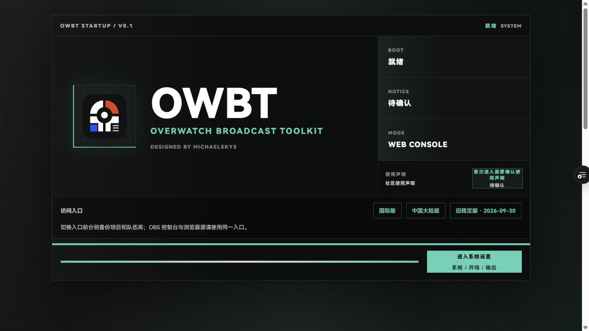
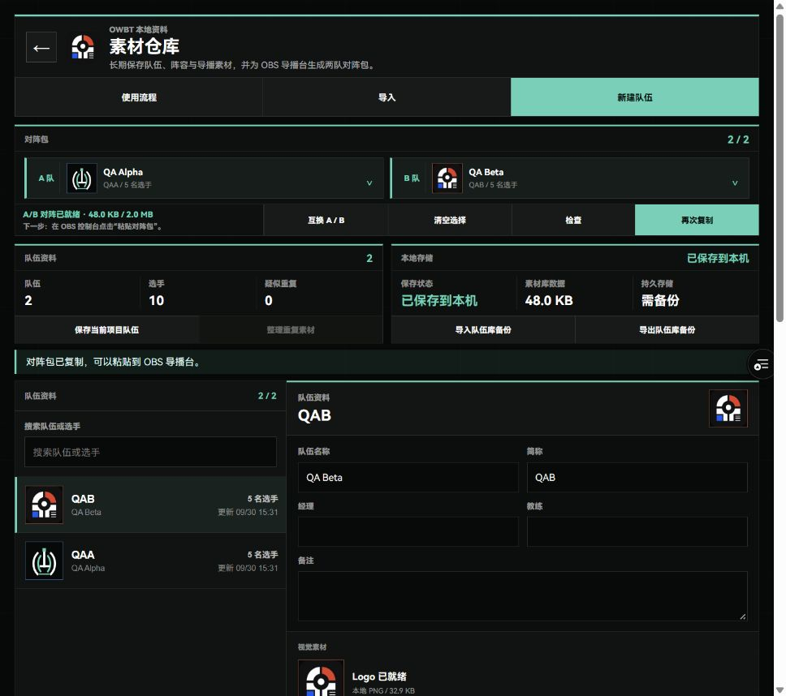
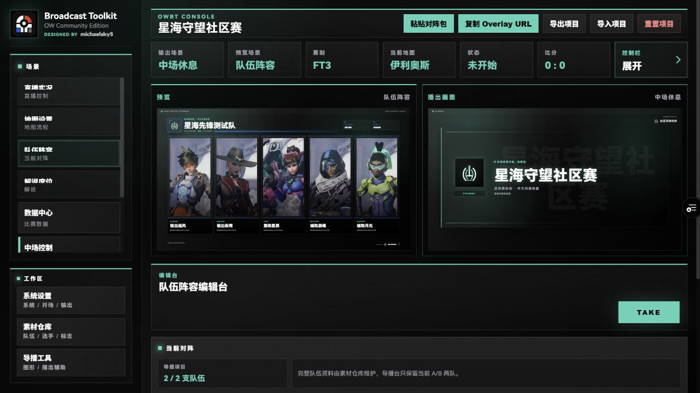

# OWBT 中文上手教程

从两支队伍，到 OBS 的第一张播出画面。

适用于 OWBT Web 的手动文本传输流程。先在非直播时段练习；示例中的队伍、选手、赛事与成绩均为虚构。

[打开网页图文教程](../public/guide/index.html)。发布后的同站点路径为 `/guide/`。

## 01 先选入口，再连接 OBS

普通浏览器用来整理长期素材；OBS 停靠窗口用来控制本场比赛；OBS 浏览器源只显示播出画面。普通浏览器里的资料不会自动出现在 OBS 中，需要传入对阵包或项目文本。

中国大陆用户可优先选择中国大陆版。控制台与浏览器源要来自同一个站点；也要在实际 OBS 中确认一次 TAKE 能更新画面。

1. 在 OBS 的「停靠窗口 → 自定义浏览器停靠窗口」新建「OWBT」，填写所选站点的 /#control 地址。首次进入请阅读使用声明。
2. 在用于直播包装的场景中新增「浏览器」源，填写同一站点的 /#overlay 地址。宽 1920、高 1080；OWBT 选择 4K 输出时使用 3840 × 2160。
3. 练习时先保持「当源不可见时关闭」和「场景激活时刷新浏览器」关闭，避免每次切场景重新载入网页。浏览器源默认 CSS 包含透明背景；OWBT 的透明输出也需要按直播布局设置。
4. 在 OWBT 系统设置中确认赛事名、Logo、主题色和输出分辨率，再进入控制台。

启动页入口示意。新增教程入口位于同一访问区域；截图来自候选版实际页面。

> OBS 版本不同，菜单文字可能略有差异。正式站、大陆站、回退站各自保存本地数据，切换站点前要分别备份项目和队伍库。

## 02 用示例项目完成第一次上屏

示例已准备好星海先锋测试队、赤焰守望测试队、两队五名首发、Logo、五张地图和 FT3 赛制。比分从 0:0 开始，可直接练习。导入完整项目会替换当前编辑与播出状态，请先导出自己的项目备份，并在非直播时段操作。

1. 在本页下方的「练习素材」打开示例项目文本，点击文本框，Ctrl+A、Ctrl+C。普通浏览器也可下载文本文件后打开复制。
2. 进入 OBS 的 OWBT 停靠窗口，选择「导入项目 → 项目文本」，按 Ctrl+V，确认导入。此步骤在 OWBT 内完成。
3. 选择左侧「队伍阵容」，查看预览中的队名与五名首发，点击编辑台的 TAKE。
4. 核对 OBS 主画面。再切到 B 队阵容并 TAKE，应看到赤焰守望测试队和橙色队伍主题。

同一组虚构练习资料在真实 OBS 中的队伍阵容输出。

> 首次接入以 OBS 主画面为准。网页中打开的另一个 Overlay 可以用于排查，但不能代替真实 OBS 浏览器源的核对。

## 03 整理自己的队伍资料

在普通浏览器打开所选站点的 /#library。素材仓库用于长期保存队伍、选手和队标；控制台里的当前对阵则只用于这场比赛。

1. 新建队伍，填写队名、简称、主题色、队标与选手资料。也可以导入已有队伍库备份、CSV 名单或 OWBT 项目中的队伍。
2. 保存整理结果，确认两支队伍各有五名可用首发，队标和名称正确。
3. 按本场的 A/B 顺序选择两队，点击「检查」查看已有素材检查结果，再点击「复制对阵包」。

素材仓库界面示意。QA Alpha / QA Beta 是早期传输测试用的虚构队伍，练习项目使用星海 / 赤焰。

> 队伍库保存在当前浏览器中。普通浏览器与 OBS、不同浏览器配置、不同电脑和不同站点的数据不会自动合并。

## 04 把两队送入 OBS

对阵包是一段包含本场 A/B 队资料的文本。它在 OWBT 停靠窗口中载入，不使用 OBS 的「场景集合 → 导入」。OBS 的场景集合管理的是 OBS 场景和源。

1. 素材仓库点「复制对阵包」后会显示完整文本。复制按钮没有成功时，点击文本框，Ctrl+A、Ctrl+C。
2. 在 OBS 的 OWBT 停靠窗口点「粘贴对阵包」，点击文本框，Ctrl+V，然后点「预览对阵包」。
3. 核对 A 队、B 队、队标、主题色和名单，阅读本次导入的影响，再确认载入。
4. 选择「直播实况」或要播出的场景，核对预览，再点击 TAKE，确认 OBS 主画面。

| 导入提示 | 它会做什么 |
| --- | --- |
| 同一对阵，刷新资料 | 更新队伍素材，保留本场比赛状态。 |
| 同一对阵，互换 A/B | 比赛数据跟随队伍换边；确认交换后的比分归属。 |
| 载入新对阵 | 重置上一场比赛数据；保留赛事、主题、FT 和地图池设置，仍需核对本场配置。 |

复制按钮不成功时，直接在这个文本框全选、复制，再到 OBS 的文本框粘贴。

> 普通浏览器可以下载 JSON 文件；OBS 内优先使用手动文本方式。无需给 OBS 剪贴板读取权限，也无需从 OBS 菜单导入 OWBT 的 JSON。

## 05 预览、TAKE 与日常操作

「预览」是准备中的画面；「播出画面 / Program」是 OWBT 当前输出。选择一个新的预览场景后，核对内容并点击 TAKE，再看 OBS 主画面。

1. 练习顺序：中场控制 → 队伍阵容 → 直播实况，每次核对预览后 TAKE。
2. 在直播实况的中央比分控制中将 A 队加一分，TAKE 后检查 OBS 的队名与比分，随后练习修改当前地图。
3. 需要暂停时，先填写暂停原因，核对暂停场景后 TAKE；恢复比赛时回到直播实况并核对输出。
4. 确认一场比赛结束后再展示赛果。换下一组对阵时，检查 A/B 顺序、首发、比分、地图和赛制。

这里预览已选队伍阵容，播出仍为中场休息。确认后在编辑台点 TAKE；截图来自练习项目的实际网页操作。

> 重置比分、互换 A/B、撤回和部分比赛控制会直接影响当前输出，不要将所有按钮都当成仅修改预览。发生误操作时先看实际输出，再使用撤回；撤回历史留在当前会话中，不能代替持久备份。

## 06 备份与恢复：选对文件

自动保存方便日常操作；开赛前、结束后、清理浏览器数据或切换站点前，请另存备份。项目和队伍库要分别保存。

1. OBS 中选择「导出项目 → 项目文本」，点击文本框，Ctrl+A、Ctrl+C，粘贴到电脑上的文本文件并保存。
2. 恢复时选「导入项目 → 项目文本」，粘贴完整备份并确认。项目导入可能改变正在输出的内容，请选择合适时机。
3. 导入后检查赛事、两队、首发、比分和地图，再选择要播出的场景并 TAKE。项目备份不会保留 OBS 场景集合、源布局和推流设置。
4. 在普通浏览器的素材仓库另点「导出队伍库备份」，保存 JSON 文件。更换电脑或浏览器时在素材仓库导入它。

| 内容 | 用途 | 正确入口 |
| --- | --- | --- |
| 对阵包 | 把选中的 A/B 两队传给导播台 | 素材仓库复制 → OWBT 粘贴对阵包 |
| 项目文本 / 项目 JSON | 保存和恢复完整赛事配置与当前比赛资料 | OWBT 导出项目 / 导入项目 |
| 队伍库备份 JSON | 保存长期队伍、选手与队标 | 素材仓库导出 / 导入队伍库备份 |

> 出现「保存失败」时，先导出包含最新编辑的项目文本，再处理素材体积或重试保存，避免刷新页面后丢失未保存的更改。

## 07 画面没有更新时怎么处理

1. 先看 OWBT 的输出场景和 Program 是否为预期内容，确认已完成 TAKE。
2. 核对停靠窗口和浏览器源来自同一个站点，分别使用 /#control 和 /#overlay，输出尺寸正确。
3. 确认项目没有保存失败提示。保存成功或已经另存备份后，再刷新自己的 OWBT 浏览器源并核对；不要清空浏览器数据来试错。
4. 需要使用旧稳定版时，先分别备份项目与队伍库，再将停靠窗口和浏览器源一起切换到回退站，导入项目文本并确认输出。回退站固定保留旧代码，最新教程中的对阵包便利操作以新版本为准。

> 当前回退站：https://owbt-stable.fries-cup.com/ 。网页代码回退与项目数据恢复是两件事：换站点后仍需导入自己的备份。

## 练习素材

- [示例项目文本](../public/guide/owbt-demo-project.txt)：在 OWBT「导入项目 → 项目文本」使用。
- [示例对阵包](../public/guide/owbt-demo-match-package.txt)：在 OWBT「粘贴对阵包」使用。
- [示例队伍库备份](../public/guide/owbt-demo-library.json)：在普通浏览器素材仓库导入。

这些文件只包含虚构队伍、选手和比赛资料。导入完整项目会替换当前编辑和播出状态，请先另存原项目备份。

## 参考

- [OBS 浏览器源官方说明](https://obsproject.com/kb/browser-source)
- [OBS 场景集合官方说明](https://obsproject.com/kb/scene-collections)

OWBT · Designed by michaelsky5。
