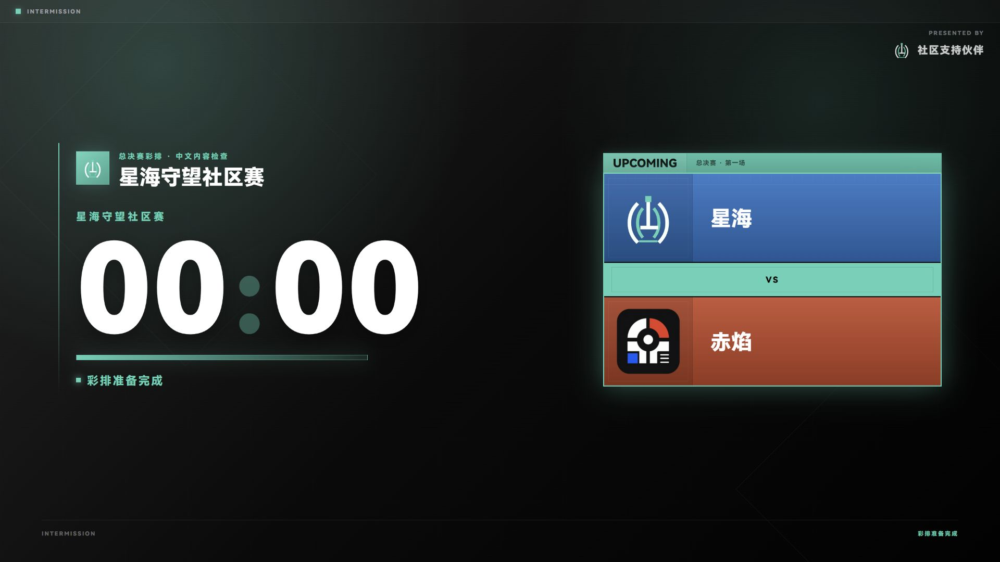
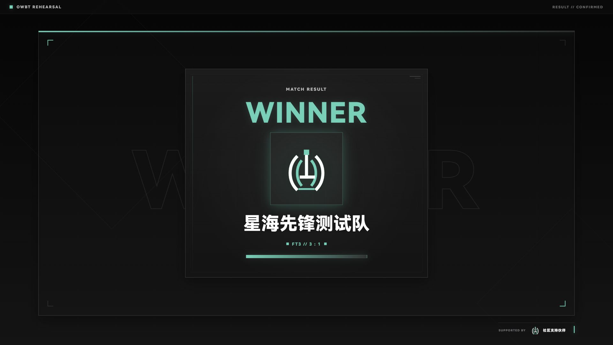
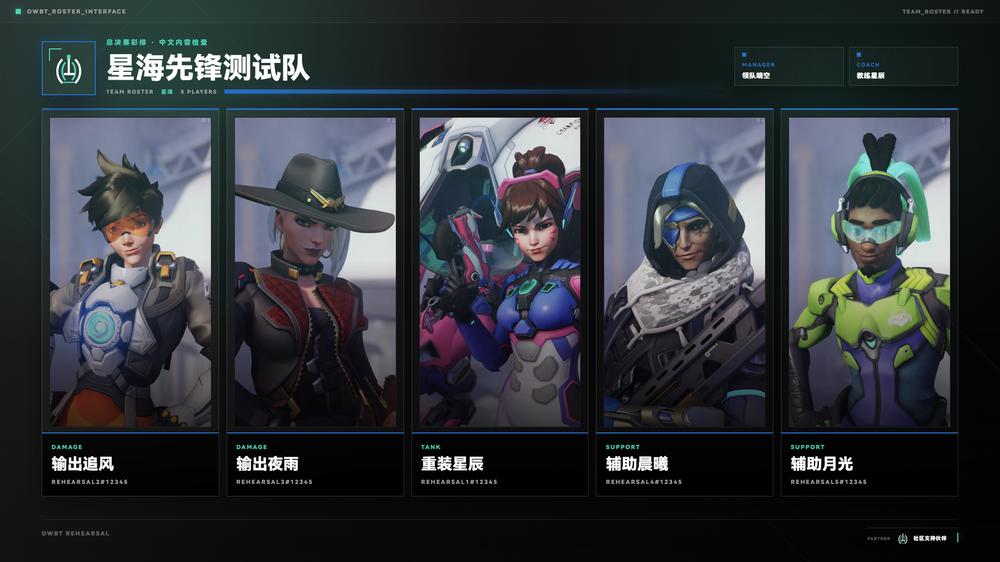
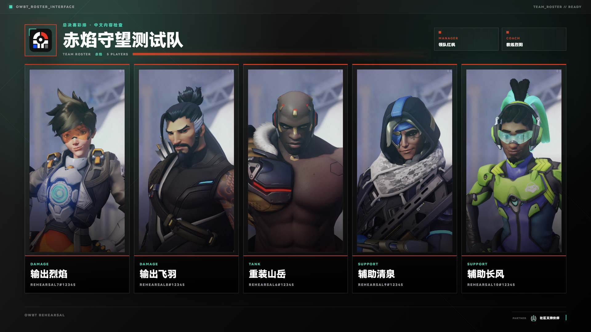
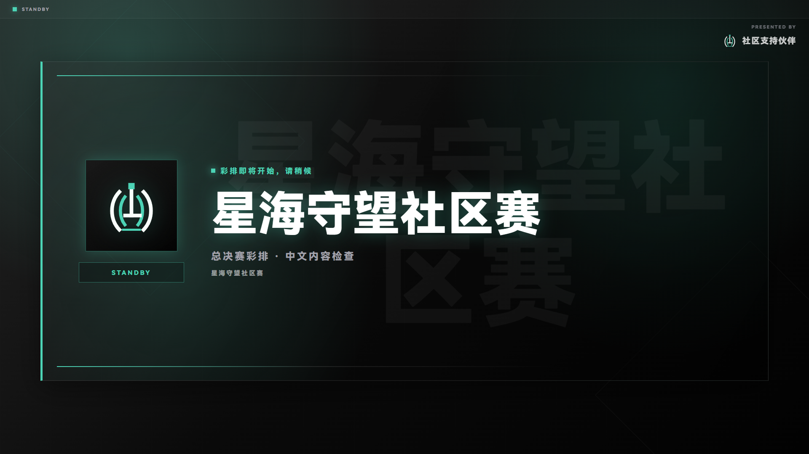

# Chinese Rehearsal and Frozen Fallback — 2026-09-30

This is a partial whole-event rehearsal, not full release sign-off. The main international and mainland deployments were not promoted.

## Environments and fixture

The local candidate was a normal production preview at `http://127.0.0.1:4202/`, with separate `#control` and `#overlay` tabs and a 1920 x 1080 viewport. The tested application inputs were from `3f601eea724a8009fd5751d1644325eb0d1172ca`; checkout `e5a7acbdcfcd8624b9102a4b86fa3328305e0a1d` added documentation only. This follow-up enables the public fallback link; the earlier scene evidence is not a newly deployed runtime acceptance.

The synthetic project uses 星海先锋测试队 / 赤焰守望测试队, five fictitious starters per side, Chinese event/caster/staff copy, two owned test logos, blue `#2670c4` and orange `#c64528`, and five Chinese map names. No real participant data or actual gameplay performance is represented.

## Candidate output checks

| Flow | Observed result |
| --- | --- |
| Preview isolation | Selecting roster while standby was on Program left the independent output on standby until TAKE. |
| Roster A and B | Team colors, logos, all five Chinese names, coach and manager fit. A transient B-side sample was repeated; the settled frame contained every name. No persistent missing glyph was reproduced. |
| Casters and staff | Both modes displayed their Chinese names and roles. |
| Map sequence | Five maps rendered with their Chinese names and map art. |
| Up Next and Starting Five | Chinese teams, stage, five A-side players, hero art, and fictitious BattleTags rendered. |
| Live HUD | Independent output DOM showed the correct A/B team names, all ten starters, and score 2:1 after score controls and TAKE. |
| Countdown | A short countdown decreased from 00:07 to 00:00 and displayed 彩排准备完成. |
| Technical pause | Chinese title/body, teams, map context, and 2:1 score rendered. |
| Result | The settled output showed 星海先锋测试队 as winner and FT3 // 3:1. The initial entrance-animation frame was not used as final evidence. |
| Thanks | Chinese heading, subtitle, stage, and both caster names fit. |

Local scene transitions were temporarily set to None for stable visual captures. These still images do not prove animation timing. Operator-reported Brand Stinger evidence remains recorded separately in [text-transfer acceptance](./2026-09-30-text-transfer.md).

## Actual OBS fallback checks

The frozen `0950bd1` site was tested on the operator's current Windows computer in OBS Studio 32.2.2. The custom OWBT QA dock used the public fallback `/#control`; the dedicated QA source used its `/#overlay`. Streaming and recording were inactive during API mutations.

The imported Chinese project restored A's roster after source refresh. A later B-side TAKE directly updated the source without refreshing. Text backup/restore recovered 彩排即将开始，请稍候, and another source refresh retained it. The source screenshots were independently read through OBS's official WebSocket API; dock operations and the intermediate edit were operator-reported.

Public HTTPS verification matched 189/189 frozen files. See [deployment identity and recovery procedure](../STABLE_WEB_FALLBACK.md).

## Follow-up coverage and optimization order

The operator reports that the stable baseline has already been used in multiple tournament broadcasts. Together with the recorded actual OBS checks, this is practical evidence for unchanged core workflows. The broader coverage below remains useful follow-up work; unfinished checks on unchanged OCR, data, media, or toolbox features are not automatic blockers for this focused text-transfer, save-feedback, recovery-entry, and operator-guide update. A reproduced regression in a required live workflow remains a blocker.

For this candidate, verify the changed transfer/save/recovery flows and new guide/download surfaces, require checks on the selected head, and record the exact preview and released runtime identities. Production promotion still requires authorization.

1. Complete OCR's real browser workflow using the prepared known-value synthetic image, then a real game screenshot with manually checked rows/time. The OCR workbench opened, but its upload action was interrupted and reconnecting localhost was rejected by the browser URL policy. No OCR success is claimed.
2. Complete Match Stats, Player Data, MVP, and media output; test a prepared five-second synthetic MP4, playback progress, and actual OBS sound. Complete toolbox/static-graphic downloads and inspect the downloaded files.
3. Repeat the relevant final-candidate transfer/restore checks when the underlying workflow changes. A normal OBS restart is appropriate for storage or synchronization changes; documentation or guide-link-only updates do not by themselves require repeating every unchanged scenario. Earlier candidate and frozen-host runtime identities remain separate.
4. Check the clean final international domain and a mainland device/network after an authorized release. A working mainland URL on this Singapore computer is not mainland network-performance evidence.
5. Keep source-license policy as an explicit owner decision. Public source visibility and the existing community/noncommercial notice do not establish a standard open-source license.

Prioritize clear operator instructions, output confirmation, and focused reliability improvements in small updates. Schedule remaining full-feature checks as follow-up coverage, and use actual event feedback to choose the next change. FryDeck already serves the user's desktop need.
