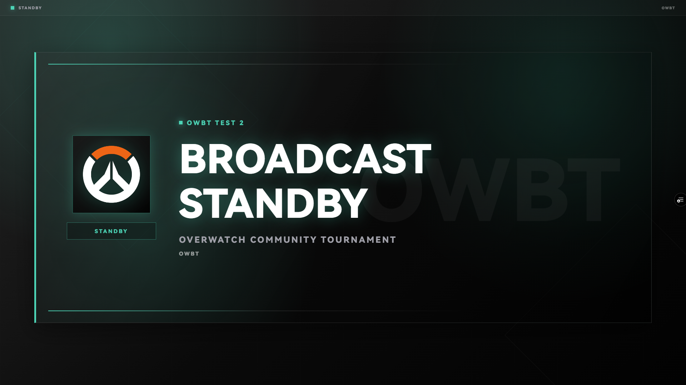
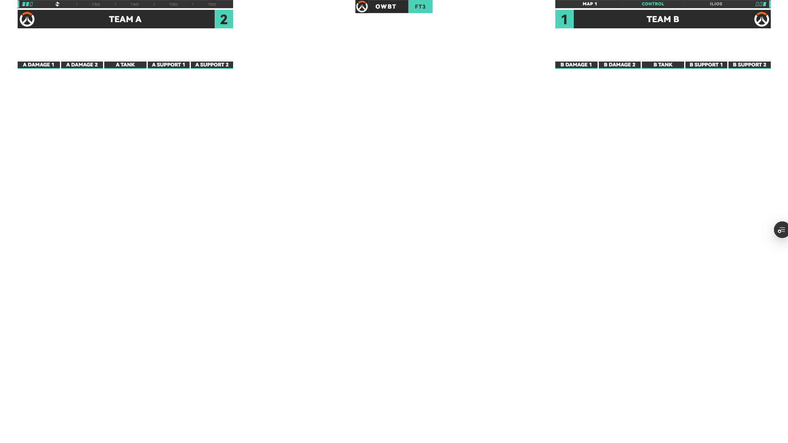

# Save-Feedback Candidate Evidence — 2026-09-30

This record covers the earlier save-feedback preview at `b23c650`. It does not establish completion of the full web release checklist or production-domain acceptance. A later operator report found that OBS did not respond to Paste Match Package; the follow-up and its separate acceptance are recorded in [text-transfer evidence](./2026-09-30-text-transfer.md). The application changed again after this preview, so these frames do not prove the latest preview passed.

- Draft PR: [#7](https://github.com/michaelsky5/ow-broadcast-toolkit/pull/7).
- Application change and tested Vercel preview commit: `b23c650ceb5bb6a6c517d59e2940fdc65b6859ec`.
- CI follow-up commit: `6d1f8f22fc0f6c5baa4fe575add3533fe62c459d`. Its complete diff from the preview commit changes only the CI image labels and release documentation.
- Vercel preview deployment: `dpl_3NgRrytHx4hRcS1Z8RcDtbLdsh1Q`, READY, preview target.
- Unique preview hostname: `ow-broadcast-toolkit-j530dfu5k-shenkeyu5-2087s-projects.vercel.app`.
- Routes used in OBS: `/#control` custom browser dock and `/#overlay` Browser Source, on the same preview hostname.
- Device: current Windows computer, OBS 32.2.2, obs-websocket 5.7.4, 1920 × 1080 canvas and Browser Source.
- The operator performed dock edits. Source frames were independently read through the official OBS WebSocket screenshot API. Captures were taken while streaming and recording were inactive.
- An independent QA scene and source were added; existing FryDeck sources were not edited.

## Code and browser evidence

Local asset validation, ESLint, all 20 tests, the production build, and diff checks passed. The [hosted CI run](https://github.com/michaelsky5/ow-broadcast-toolkit/actions/runs/36674950677) passed on Ubuntu 24.04 and Windows 2025 for the CI follow-up commit above.

The hosted browser control retained its edit and Program state after TAKE and reload. A separate local quota-failure simulation covered the save warning, latest-edit text backup from console and setup, failed retries, independent project/Program recovery, and successful persistence after full recovery. Live data delivery was verified for an already-connected Overlay in the same browser environment. This does not guarantee that a newly opened or reloaded Overlay can recover unsaved data.

## Actual OBS results

| Check | Observation | Result |
| --- | --- | --- |
| Edit before TAKE | After the operator edited the standby text, the actual source still showed `PLEASE STAND BY`. | Passed |
| TAKE | The source changed to the operator's test text after TAKE. | Passed |
| Same-scene content update | A second edit and TAKE displayed `OWBT TEST 2` in the same scene. | Passed |
| Dock and source refresh | The operator refreshed the dock, then the QA Browser Source was refreshed through OBS. The source retained `OWBT TEST 2`. | Passed |
| Normal OBS restart | The operator reported the saved dock text remained. OBS process ID changed from 24308 to 44916, and the source again showed `OWBT TEST 2` without another TAKE. | Passed |
| Different-scene switching and scores | The operator switched from standby to Live HUD, set A to 2 and B to 1, pressed TAKE, and reported a normal switch. The independently captured source showed `2:1`. | Passed for this route |
| Configured transition animation | Static source frames do not establish that Brand Stinger plays correctly between scenes or during same-scene TAKE. | Pending |
| Project text export and restore inside OBS | The operator exported project text, reported changing the score to `3:3`, imported the backup text, and pressed TAKE. The independently captured source showed the restored `2:1`. | Passed |
| External-browser A/B match package pasted into the OBS dock | The operator reported no response when attempting to paste. A follow-up removes the clipboard-read wait before showing the text dialog. | Failed; follow-up acceptance pending |

Before TAKE:

After the second content update, refresh, and normal OBS restart:

Live HUD after project text restore:

The small control at the right edge is Vercel's preview toolbar. These preview frames are separate from acceptance of a clean output on the formal production domain. Temporary authenticated preview links are omitted from this record.

## Publication status

At the time of this check, the formal domain remained on stable commit `0950bd15fbb7fd9a54d62a7cf392e3fc2e0de79a` and deployment `dpl_CgnKM37NwVi8YsVRmpLVy8EDhuPQ`. The candidate was not merged or promoted. Complete the pending checks and refresh the release record before publishing.
