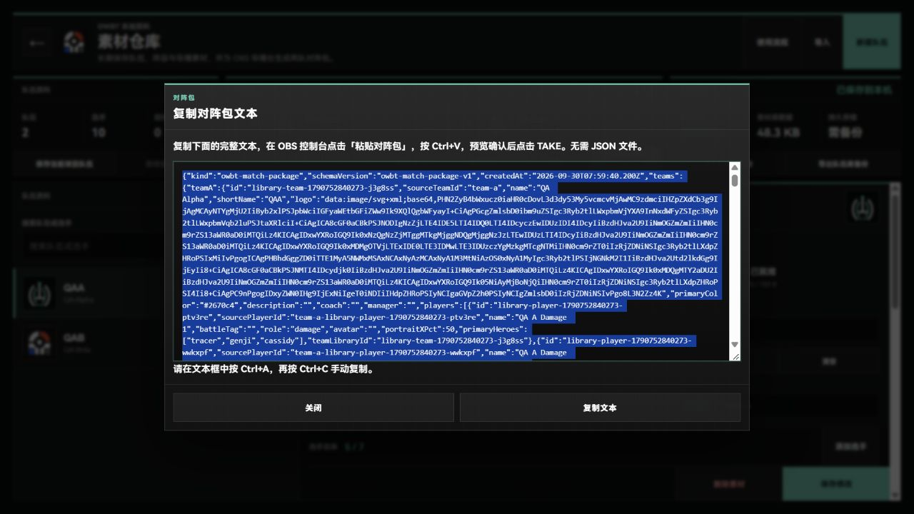
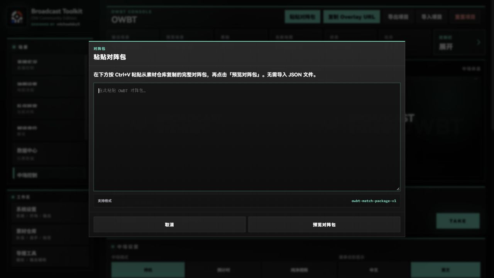
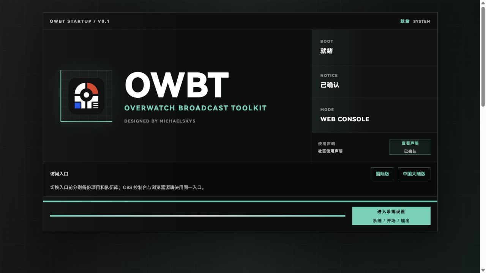
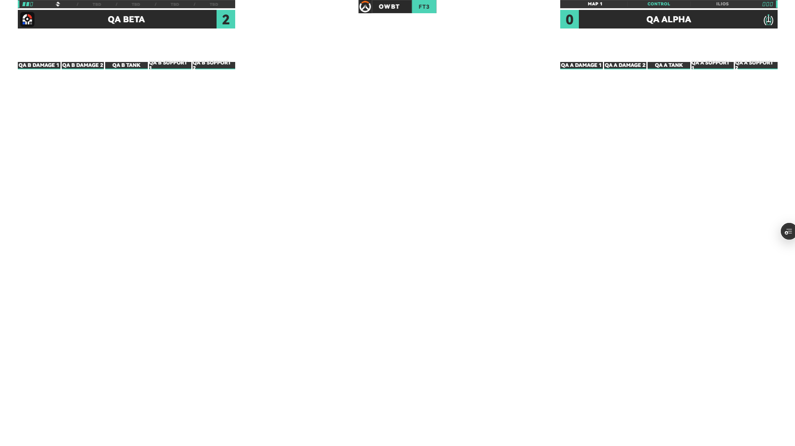
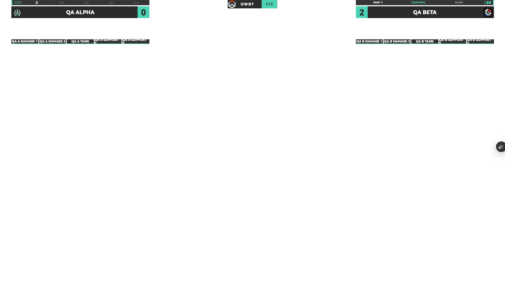

# OBS Text Transfer Follow-up — 2026-09-30

## Trigger and behavior

The operator reported that clicking Paste Match Package in the earlier OBS preview produced no response. The previous handler awaited `navigator.clipboard.readText()` before opening any dialog. An embedded browser can leave that promise unresolved, so rejection handling alone cannot guarantee that a manual input appears.

The follow-up opens a focused text box synchronously. The operator presses Ctrl+V, previews the validated package, reviews refresh/swap/new-match impact, confirms, and TAKEs. The library always opens a complete-text dialog before attempting a clipboard write; writes have a bounded wait and the text stays visible after copying. No JSON picker is involved. Existing schema, impact classification, project import/export, and persistence keys remain unchanged.

The actual OBS failure establishes the observed no-response behavior. The unresolved-read explanation is supported by the previous code and a local fault simulation; the internal OBS promise was not instrumented.

## Hosted candidate

- Tested application commit: `3f601eea724a8009fd5751d1644325eb0d1172ca`.
- Vercel deployment: `dpl_3njoA95pciwrBa32ZWApLGxfntsS`, READY, non-production branch deployment.
- Unique host: `ow-broadcast-toolkit-k206ciyv7-shenkeyu5-2087s-projects.vercel.app`.
- Ubuntu 24.04 and Windows 2025 checks both passed for this commit, with no annotations: [Actions run 36688033278](https://github.com/michaelsky5/ow-broadcast-toolkit/actions/runs/36688033278).
- The hosted control immediately opened the focused text dialog with Ctrl+V instructions when Paste Match Package was clicked.
- The independent QA Browser Source was updated to the same new host through the OBS API while streaming and recording were inactive. Existing FryDeck inputs were not edited. A loaded default source frame alone is not package-transfer acceptance.
- Any later documentation-only commit is separate from this tested runtime; verify the complete diff excludes application and build inputs before reusing its runtime evidence.

## Local validation

- Asset checks, ESLint, all 23 tests, and the production build passed; the build transformed 184 modules.
- Regression coverage includes fulfilled, unavailable/rejected, and never-settling clipboard writes.
- A local QA server made both clipboard reads and writes return promises that never settle. The control still immediately showed its manual text dialog. A valid package preview and new-match confirmation loaded QA Alpha and QA Beta, with five players per side, and TAKE displayed the teams.
- The library's complete text remained visible with Ctrl+A/C instructions under the same fault simulation. The actual DOM text was saved and parsed as `owbt-match-package-v1`: 49,507 characters, two logos, five players per side, A color `#2670c4`, and B color `#c64528`.
- The library-generated text was then previewed in the control; the same-match refresh was identified and the preserve-match-state message appeared.
- Startup and System Settings show International and Mainland China links. The supplied mainland hostname opened the OWBT startup page on this device. This is not mainland-network performance evidence.
- Startup at an actual 390-pixel viewport had a 390-pixel document width; the new links fit. The startup can scroll vertically to reach the action button. This does not establish all-page mobile acceptance.

## Actual OBS Acceptance

The updated application commit was tested on the operator's current Windows computer with OBS Studio 32.2.2. The custom OWBT QA dock and the independent QA Browser Source used the same immutable candidate hostname recorded above. Streaming and recording were inactive during API operations; the existing FryDeck inputs were not edited.

| Check | Evidence and result |
| --- | --- |
| Native text paste, preview, confirmation, and TAKE | The operator confirmed the updated dock loaded QA Alpha and QA Beta. A source screenshot independently showed both names, both logos, and all ten synthetic starting-player names. |
| Score control and source synchronization | After two A-side +1 operations, the actual Browser Source showed QA Beta 2 on the left and QA Alpha 0 on the right. The operator confirmed the dock's current A-side name matched the output. |
| Explicit A/B order and preserved score during swap | The actual library-generated package was copied into a newly named text file with A=QA Alpha and B=QA Beta. The operator confirmed that order and the blue/orange colors in the package preview, applied the swap/update confirmation, and TAKEd. The independently captured source then showed Alpha 0 on the left and Beta 2 on the right, with the correct logos and five players per side. The points followed Beta during the swap. |
| Brand Stinger between scenes and during same-scene TAKE | The operator reported both animations visible, with Brand Stinger and Standard speed selected. Animation frames were not independently captured; static output screenshots are not animation proof. |
| Source refresh | The QA Browser Source was refreshed through the OBS API and eventually restored the earlier 0:0 output with both teams and rosters. The subsequent score and swap changes also reached it. Normal OBS restart acceptance was performed for the earlier runtime, not repeated for this updated runtime. |

The first rendered A/B order differed from the supplied file's order. No code change was made based on that discrepancy alone. The explicit-order repeat above verified the new incoming order and score preservation against the actual output.

Blue/orange team colors were confirmed by the operator in the OBS package preview. The Live HUD uses the shared theme accent, so these screenshots do not independently establish roster-scene color rendering. The Vercel preview toolbar is also visible; clean formal-domain output remains a separate gate.

## Remaining gates

- Complete the remaining full-release checklist. Chinese candidate output and frozen-host roster colors have partial rehearsal evidence; OCR, media, static graphics, and a whole-event rehearsal remain unfinished. See [rehearsal](./2026-09-30-rehearsal.md).
- Complete clean production-domain output acceptance and a mainland-device/network check.
- Repeat updated-runtime restart/recovery as part of that final rehearsal; keep earlier-runtime evidence separate.
- The separate frozen host has now passed public-file and core actual OBS checks; the candidate follow-up enables its public link. See [fallback record](../STABLE_WEB_FALLBACK.md).

The main production domain remains on the recorded stable baseline. The draft candidate has not been merged or promoted.
